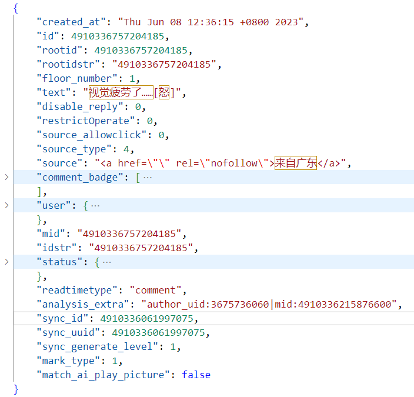

# Spammer_Weibo

Including historical behavior data of 685 high-risk users (spammer) on the Weibo platform. Among them, there are 342 high-risk users (spammer) and 343 ordinary users. And, a single user folder **behaviors** contains multiple historical behaviors of the user in the past six months, while **images** contains multimodal data corresponding to historical behaviors, both linked by behavior IDs.

Baidu link: https://aistudio.baidu.com/datasetdetail/290754.

Kaggle link: [https://aistudio.baidu.com/datasetdetail/270658](https://aistudio.baidu.com/datasetdetail/270658).

# Datasets Construction

  
**Figure 1:** The original data obtained by the Weibo API. The figure shows a single comment data. In particular, `"comment_badge"`, `"user"`, and `"status"` are secondary dictionaries.

  
**Figure 2:** Collection process for spammer accounts

| Source                               | Description                                                                                                                                                                | URL                                                       |
|--------------------------------------|----------------------------------------------------------------------------------------------------------------------------------------------------------------------------|-----------------------------------------------------------|
| **Weibo Community Management Center** | The official display website for WEIBO. Displayed content is officially reviewed fake news, user dispute judgements and spammer accounts.                                 | [https://service.account.weibo.com/](https://service.account.weibo.com/) |
| **Spammers Display Platform**        | The official website of WEIBO for displaying spammers' accounts. All displayed accounts are determined based on user submissions and official manual review.                | [https://service.account.weibo.com/toppunish](https://service.account.weibo.com/toppunish) |
| **Spam Display Platform**            | The official website of WEIBO for displaying spam (fake news).                                                                                                             | [https://service.account.weibo.com/?type=5&status=4](https://service.account.weibo.com/?type=5&status=4) |
| **China Fact Check**                 | A platform to fact-check Chinese international news.                                                                                                                       | [https://chinafactcheck.com/](https://chinafactcheck.com/) |
| **China Joint Internet Rumor-Busting Platform** | A joint rumor (fake news) display platform launched by the Chinese government. It contains fake news from all social media platforms in China.                            | [https://www.piyao.org.cn/](https://www.piyao.org.cn/)    |

**_Collection:_**  
The TWITTER dataset (i.e., Individual-Behavior [1] and Multi-Behavior [2]) uses publicly available datasets. Subsequently, the WEIBO dataset is constructed. The data collection process is shown in Figure 1.

### Spammer Account Collection

In contrast to the TWITTER dataset, WEIBO officially identifies accounts as spammers by restricting access to other users and deleting accounts. The official measures are taken to prevent spammers from continuing to cause harm. Therefore, it is not possible to collect users from the official WEIBO spammer account display platform [3]. However, as WEIBO is a mainstream social platform in China, it is important to identify spammers. To continue the research, we used other strategies to collect spammers' information. Because spammers often send fake news, information about users who send fake news is collected in advance. Subsequently, the candidate users are compared with the WEIBO spammer display platform to construct a spammer dataset.  

The specific process contains three main steps:

1. **_Collecting fake news:_**  
   The Chinese government has constructed a rumor display platform to reduce the impact of rumors (fake news) (see Table 1 Button). The platform contains information on rumor topics across platforms, including WEIBO, TikTok (Douyin), and Xiaohongshu. Meanwhile, WEIBO has also built its official rumor (fake news) display platform. Therefore, a fake news dataset (ind-Weibo) is collected based on the official platform (see Figure 1, Left).

2. **_Determine the order of spammer candidate accounts:_**  
   The fake news dataset contains a large number of candidate accounts. When a user is identified as a spammer by WEIBO officials, the officials take action immediately. Meanwhile, the user's historical behavior information contains a large amount of data. For instance, a user with the nickname "Zhuge Lao Tiezhu" has more than 20,000 historical behaviors. In addition, the average number of user behaviors in the spreading space is more than 370,000, of which 199,753 are comments and 174,994 are retweets. The user's data consumes more than 470 MB.  

   Therefore, it is necessary to determine the user's level of importance to target the best candidates more quickly. Considering that the more users send fake news, the higher the potential to become spammers, we prioritize the collection of user history behavior information by weighting the number of sent fake news (see Figure 1, Left).

3. **_Identify the spammer account:_**  
   Compare candidate accounts with the Weibo spammer display platform (see Table 1, Top) to determine if the user is a spammer (see Figure 1, Right). Simultaneously, information about spammers' historical behavior is put into our publicly available Weibo dataset (multi-Weibo). Due to the high real-time nature of this task, we have only correctly collected 342 items of data after one year. In the future, we will continue the data collection.

### Normal Account Collection

Firstly, the account addresses are collected randomly. Subsequently, comparisons with the spammer display platform and the fake news dataset filtered for non-existent accounts. After that, normal accounts are screened using manual review. In particular, we collected a large number of normal accounts.  

Because TWITTER is a typical unbalanced dataset, our initial intention is to construct a balanced dataset to validate the model performance. Therefore, 343 normal accounts are randomly selected to be put into our publicly available datasets.

---

### References
[1] Leyan Deng, Chenwang Wu, Defu Lian, Yongji Wu, and Enhong Chen. Markov-driven graph convolutional networks for social spammer detection. IEEE Transactions on Knowledge 252
and Data Engineering, 35(12):12310–12322, 2023. 

[2] Yang Liu and Yi-Fang Wu. Early detection of fake news on social media through propagation path classification with 255
recurrent and convolutional networks. In AAAI, 2018. 

[3] Jing Ma, Wei Gao, Zhongyu Wei, Yueming Lu, and KamFai Wong. Detect rumors using time series of social con- 258
text information on microblogging websites. In CIKM, pages 1751–1754, 2015.
